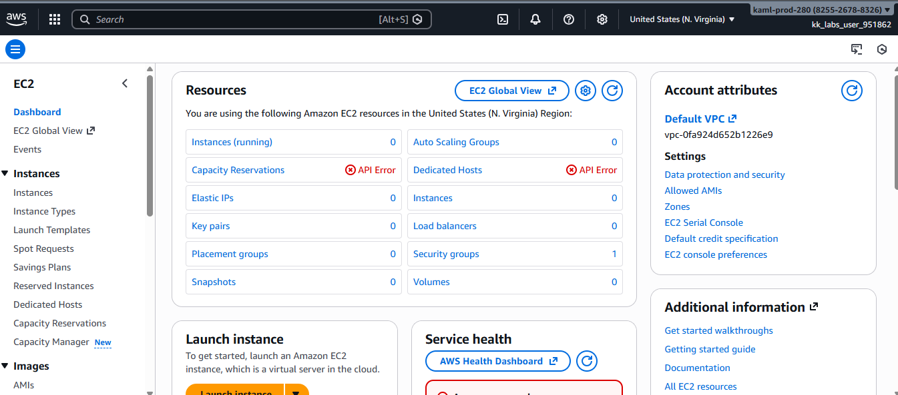
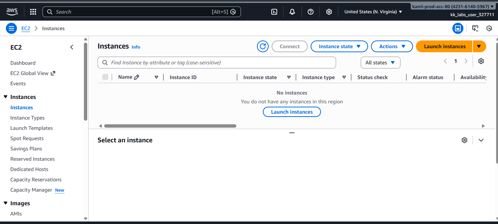
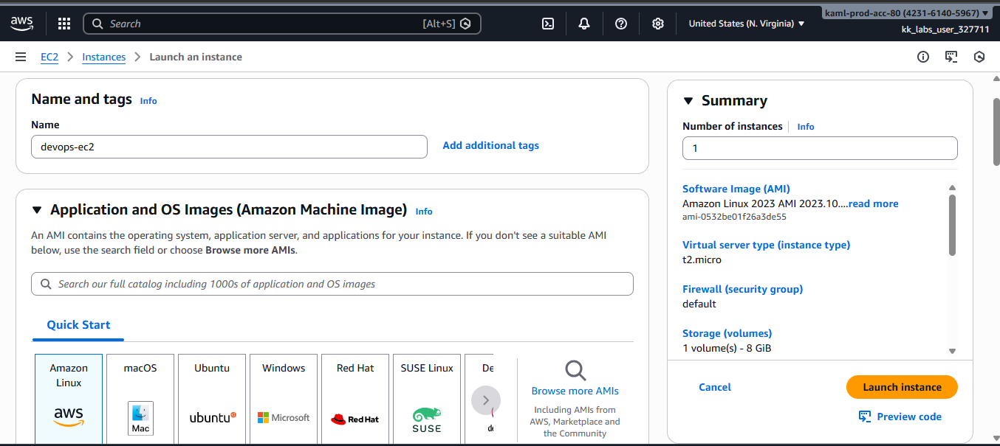
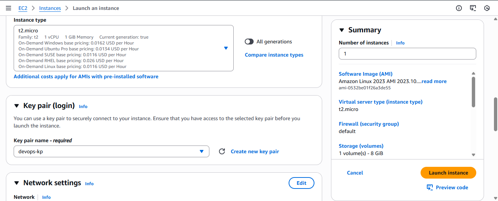
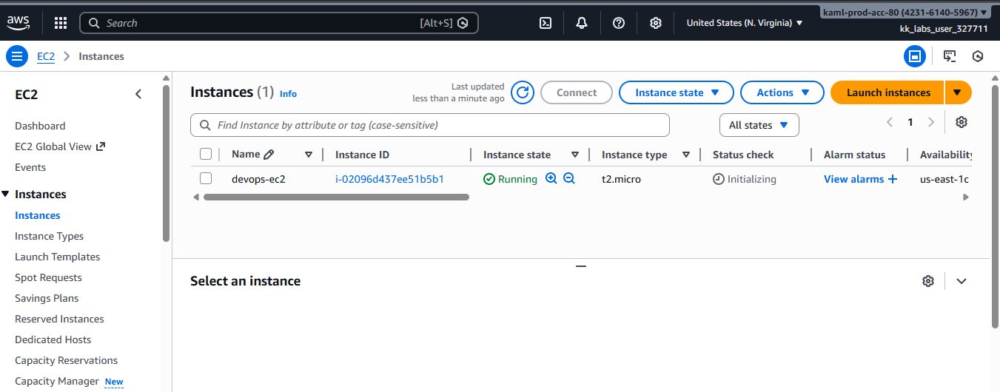

# Launching-an-EC2-Instance

This guide demonstrates how to create an Amazon EC2 instance using the **AWS Management Console (GUI)**.  
The setup follows an incremental cloud migration approach by provisioning a simple EC2 instance with basic configurations.

## What is an EC2 Instance?

An Amazon EC2 (Elastic Compute Cloud) instance is a virtual server in the AWS cloud that allows you to run applications and workloads without managing physical hardware. EC2 provides scalable computing capacity, meaning you can easily increase or decrease resources such as CPU, memory, and storage based on your needs.
EC2 instances are commonly used for hosting websites, running applications, performing data processing, and supporting development and testing environments.

## Step 1: Log in to the AWS Console

1. Navigate to the **AWS Management Console**
2. Sign in with your credentials
3. Confirm the correct AWS region (top-right corner)

## Step 2: Open the EC2 Dashboard
1. Search for **EC2** in the AWS search bar
2. Click **EC2** to open the dashboard
3. Click **Launch instance**

## Step 3: Launch a New Instance
Click **Launch instance** to begin configuration.

## Step 4: Name the EC2 Instance
Under **Name and tags**:
- Key: 
- Value: 

## Step 5: Choose an Amazon Machine Image (AMI)
- Select **Amazon Linux**
- Use the default **Amazon Linux 2 AMI**

## Step 6: Select Instance Type
- Choose **t2.micro**

## Step 7: Create a New Key Pair
1. Click **Create new key pair**
2. Configure:
   - **Name:** `devops-kp`
   - **Key pair type:** RSA
   - **File format:** `.pem`
3. Click **Create key pair**
4. Store the downloaded key securely

## Step 8: Configure Network and Security Group
- Leave all network settings as **default**
- Ensure the **default security group** is selected

## Step 9: Launch the Instance

1. Review all configurations
2. Click **Launch instance**

## Step 10: Verify Instance Status
1. Navigate to **EC2 → Instances**
2. Confirm:
   - Instance name: `devops-ec2`
   - State: **Running**

##  Key Takeaways
- Amazon Linux is optimized for AWS workloads
- `t2.micro` is lightweight and cost-effective
- Key pairs enable secure access to EC2 instances
- Default security groups provide baseline network protection
